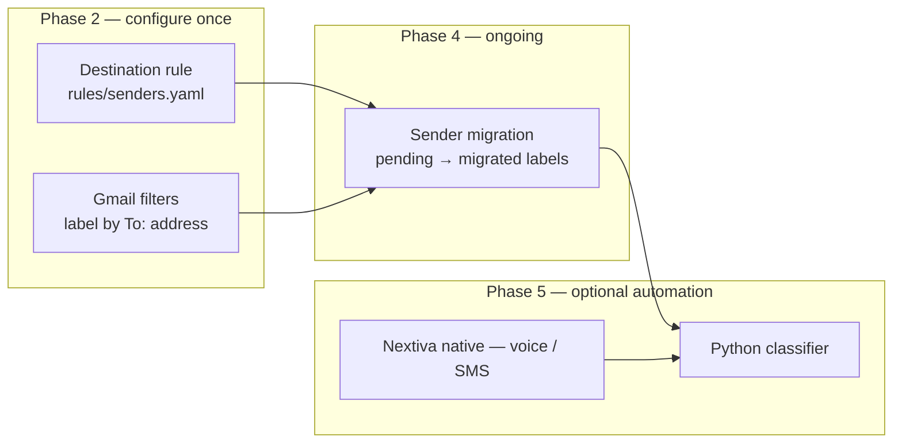

# Communications Consolidation & Migration Runbook

**Owner:** Shawn Becker · Spexture
**Goal:** Route business communications into one categorized/processed chain, keep personal communications in a separate walled-off hub, and migrate senders from old surfaces to their correct permanent home incrementally — with zero lost messages in the meantime.

---

## End-state architecture

Two destinations. Every sender routes to exactly one.

**Professional chain (categorized / processed)**

- Email: `shawn.becker@spexture.com`
- Phone & text: `(385) 403-3248` (hosted in Nextiva)
- Nextiva handles transcription, classification, routing, summaries for these channels.

**Personal hub (walled off — never touches Nextiva)**

- One consolidated inbox fed by the old personal addresses:
  - `sbecker@alum.mit.edu`
  - `shawn.becker@yahoo.com`
  - `scbboston@gmail.com`
- Friends and family keep using whatever old address they know — they change nothing.

**Routing inventory:** Forwards, categorization routes (politics, church, investing, insurance, billing), the recruiting funnel, and sensitive-category migration order are documented in [`routing-inventory.md`](routing-inventory.md). Processing logic for the recruiting funnel lives in the [job-tracker](https://github.com/sbecker11/job-tracker) repo, not here.

---

## Phase 0 — Lock architecture decisions

- [x] **Old phone number:** port into Nextiva (preserves continuity, no lost texts). *Decision: port old number to Nextiva — invisible to callers; existing dialers keep working.*
- [x] **Personal hub:** `scbboston@gmail.com`. *Decision: canonical personal inbox.*
- [x] **Professional hub:** `shawn.becker@spexture.com` + `(385) 403-3248` (Nextiva). *Decision: canonical business email and phone.*
- [ ] **Destination rule defined:** business-relevant senders → professional hub; personal senders → personal hub. Sort up front so you're not deciding ad hoc per vendor. *(Use `contacts/Contacts.yaml` + web editor — see `contacts/README.md`; export to `rules/senders.yaml` when ready.)*

**Phone port vs. announcement:** Nextiva hosts both numbers during transition. The **old number** is ported in so callers see no interruption. **`(385) 403-3248`** is the canonical *professional* number announced in Phase 3 — steer new and business contacts there over time; the ported old number remains a safety net until traffic dies down.

**Destination rule ≠ inbox rules:** These are different layers — do not express the destination rule as Mac Mail / Gmail triage rules (junk, invitations, color labels). See Appendix D for the full layering model.

| Layer | Question it answers | Implementation | Phase |
|---|---|---|---|
| **Ingress / provenance** | Which old address did they use? | Gmail filters (label by `To:`) | 2 |
| **Destination rule** | Which hub does this *sender* belong on? | `contacts/Contacts.yaml` → `rules/senders.yaml` | 0, 4 |
| **Classifier / actions** | What kind of message; what to do? | Nextiva native and/or Python (Appendix D) | 5 |

**Contact groups (recommended):** Import macOS Contacts, assign each person to `Professional` or `Personal` via the local web app (`contacts/README.md`). Use `Is Deleted` to hide obsolete entries.

**Destination rule — starter sender table** (domains / edge cases; add to `rules/senders.yaml`):

| Sender (domain, email, or phone) | Hub | Notes |
|---|---|---|
| `spexture.com` (domain) | professional | Own company |
| _client domain_ | professional | |
| _recruiter@agency.com_ | professional | |
| _cousin@example.com_ | personal | |
| _amazon.com_ (receipts) | personal | Personal shopping |
| _aws.amazon.com_ (invoices) | professional | Business tooling |
| **default: unknown** | personal | Flag for review; override if business-looking |

**Classifier contract:** input → output field mapping is in Appendix B. Architecture and invocation are in Appendix D.

---

## Phase 1 — Stand up the professional telephony chain (Nextiva)

- [ ] Port **old phone number** into Nextiva (Phase 0 decision — continuity for existing callers).
- [ ] Port `(385) 403-3248` into Nextiva so it _hosts_ the number (required for texts — SMS cannot be forwarded).
- [ ] Start **10DLC / A2P texting registration immediately** — it has lead time and SMS won't work until it clears.
- [ ] Enable **voicemail-to-email + transcription** (transcription requires voicemail stored on Nextiva's system).
- [ ] Connect `shawn.becker@spexture.com` as an email channel in Nextiva — _or_ plan the custom aggregator (Gmail/Workspace API) if you want full control.
- [ ] Verify: test call, test text, and a voicemail all land and process correctly.

---

## Phase 2 — Stand up the personal hub

- [x] Confirm the hub inbox: `scbboston@gmail.com` (Phase 0 decision).
- [ ] **MIT alum** (`sbecker@alum.mit.edu`): it's a forwarding alias — point its destination at `scbboston@gmail.com`.
- [ ] **Yahoo** (`shawn.becker@yahoo.com`): already on **Yahoo Mail+** (paid) — auto-forwarding is available. Point Yahoo's forward destination at `scbboston@gmail.com`. _(POP-fetch via Gmail's "Check mail from other accounts" is only needed if you drop Mail+.)_
- [ ] **Hub Gmail** (`scbboston@gmail.com`): this _is_ the hub — no self-forward needed. Configure send-as for MIT alum and Yahoo aliases below.
- [ ] Configure **"Send mail as"** for each alias so replies go out from the address the sender used.
- [ ] Configure **Gmail filters by to-address** (server-side; runs on delivery — preferred over Mac Mail rules, which only run when your Mac syncs):
  - `to:shawn.becker@yahoo.com` → label `provenance/yahoo`
  - `to:sbecker@alum.mit.edu` → label `provenance/mit`
  - `to:scbboston@gmail.com` → label `provenance/gmail`
  - Migration tracking: label `migration/pending` on mail from senders not yet moved; `migration/migrated` after Phase 4 safe-swap
  - Optional: Mac Mail rules for local triage (junk, invitations, contact coloring) — redundant with Gmail filters for labeling; see Appendix D.
- [ ] **Secure the hub:** strong unique password + 2FA — it now aggregates three identities, so it's a single point of compromise.
- [ ] Verify: send a test to each old address and confirm it lands in the hub and you can reply _as_ that address.

---

## Phase 3 — Announce (only after Phase 1 is verified working)

> Sequencing matters: announce **after** both number ports + 10DLC registration complete, or early texters hit a dead number.

- [ ] Email blast to **professional** contacts (variant — see Appendix A). Announces `(385) 403-3248` as the new business number; email unchanged at `shawn.becker@spexture.com`.
- [ ] One-time text from `(385) 403-3248` so it lands in people's threads with caller ID.
- [ ] LinkedIn note for professional contacts without your email.

> **Note:** The ported old number keeps working silently — no announcement needed for personal contacts still using it. Phase 4 migration gradually moves senders to the correct permanent surface.

Three drafted variants (professional / casual / short text) are available in the chat thread.

---

## Phase 4 — Incremental sender migration (the ongoing work)

**The hub is your safety net and your worklist.** Every message still arriving at an old address = a sender not yet migrated. When a sender goes quiet on the old address, it's done. Use `pending` / `migrated` labels to track.

**Safe-swap procedure per account:**

1. Add and verify the new contact info (email and/or phone).
2. Confirm receipt at the new destination.
3. Confirm 2FA / recovery still works.
4. Only then remove the old info.

**Sequencing:** low-stakes marketing & e-commerce first (build the routine) → financial, identity, and 2FA-bound accounts last (move deliberately).

**Cautions:**

- **VoIP 2FA rejection:** the Nextiva number is VoIP; many banks and security-sensitive services reject VoIP numbers for SMS OTP. Keep a real mobile line for those. Test on a low-stakes account first.
- **Never orphan a recovery path** mid-switch.
- **Some senders never honor changes** (marketing lists). That's fine — the hub keeps catching them; filter or ignore.

**Destination reminder:** business purchases / tools / subscriptions → professional chain; personal shopping → personal hub. Don't pollute the business chain with personal receipts.

---

## Phase 5 — Categorization & action layer (optional, later)

**Native Nextiva** gives you sentiment, classification, routing, and post-interaction summaries for its channels out of the box.

**Custom classifier** (your build) for full control and a single pane — full stack and dataflow in **Appendix D**:

- Normalize every channel to one schema (Appendix B).
- Categorize by **source + subject + content**.
- Action tiers: **Notify now** → **Digest** → **Draft for approval** → **Auto-handle** (`rules/actions.yaml`).
- Keep **human-in-the-loop** on client/recruiter-facing actions; promote categories to full automation only after watching them behave.
- The same classifier can point at the personal hub if you ever want uniform processing under _your_ control rather than the vendor's.

**Recommended phasing for custom code:**

| Sub-phase | Scope | Custom code? |
|---|---|---|
| 5a | Nextiva for voice/SMS; Gmail filters for personal | No |
| 5b | Python watcher on `scbboston@gmail.com` for misrouted business mail | Small Python service |
| 5c | Unified pane: Gmail + Nextiva → one normalized inbox | Full Python aggregator |

---

## Appendix A — Professional announcement (email)

**Subject:** Updated contact info — new phone number

> Hi all,
>
> A quick housekeeping note. My email is unchanged and remains the best way to reach me: shawn.becker@spexture.com.
>
> My phone and text number, however, has changed. Please update your records:
>
> **New number: (385) 403-3248**
>
> Going forward, please use this number for any calls or texts. Email stays the same for anything detailed.
>
> Thanks,
> Shawn Becker
> Spexture

---

## Appendix B — Normalized message schema & classifier contract

**Canonical record** (all channels normalize to this):

```
{
  message_id,
  channel:        voice_vm | sms | email,
  received_at,
  sender: { display_name, address_or_number, known_contact: bool,
            relationship: client | recruiter | vendor | personal | unknown },
  subject,        // email subject; derived or empty for voice/sms
  body,           // voicemail transcript for voice_vm
  thread_id,
  category,       // assigned by classifier
  urgency,        // low | normal | high
  suggested_action
}
```

**Input properties** (extracted from raw message):

| Field | Source |
|---|---|
| `comm_source` | Channel the message arrived on |
| `from_address` | Email: sender address; phone call: caller ID; SMS: from-number |
| `sender_first_name` | Parsed or looked up |
| `sender_last_name` | Parsed or looked up |
| `sender_company` | Parsed or looked up |
| `sender_email` | Sender identity (may differ from `from_address` on forwarded mail) |
| `sender_phone` | Sender identity phone |
| `message_summary` | Subject line, transcript excerpt, or generated summary |

**Output properties** (classifier assigns):

| Field | Values / notes |
|---|---|
| `category` | `professional` \| `personal` |
| `subcategory` | e.g. `recruiter_initial_call`, `recruiter_follow_up`, `active_client`, `financial`, `vendor`, `spam` |
| `target_hub` | `professional` (`shawn.becker@spexture.com` / Nextiva) \| `personal` (`scbboston@gmail.com`) |
| `urgency` | `low` \| `normal` \| `high` |
| `suggested_action` | See Appendix C |

## Appendix C — Category → signal → action

| Category               | Trigger signals                            | Default action                                      |
| ---------------------- | ------------------------------------------ | --------------------------------------------------- |
| Active client          | Known client domain/number                 | Notify now; draft reply (hold for approval)         |
| Recruiter / job        | Recruiter language, JD content, scheduling | Tag → match-triage; draft acknowledgment for review |
| Personal               | Known personal contact                     | Route to personal hub                               |
| Financial / admin      | Banks, invoices, account notices           | Flag; no auto-action                                |
| Vendor / transactional | Receipts, confirmations, newsletters       | Daily digest                                        |
| Spam / unknown         | Unrecognized sender                        | Quarantine                                          |

---

## Appendix D — Architecture & implementation

### Three rule layers

The system uses **three rule layers** at different depths — not one monolithic engine:

1. **Ingress / provenance (Phase 2)** — "Which old address did they reach?" Gmail filters label by `To:` on delivery. Mac Mail rules are optional and local-only.
2. **Destination rule (Phase 0, 4)** — "Which hub does this *sender* belong on permanently?" Policy + sender list (`rules/senders.yaml`). Not the same as inbox triage rules.
3. **Classifier / actions (Phase 5)** — "What kind of message is this; what do I do?" Nextiva native for professional voice/SMS, or custom Python for unified processing.

During migration, ingress and destination can disagree (e.g. a client still emails `scbboston@gmail.com`). The personal hub catches it; the destination rule says where they should *eventually* live.

### End-to-end dataflow

```mermaid
flowchart TB
  subgraph senders [Senders]
    S1[Client / recruiter / vendor]
    S2[Friends / family]
    S3[Unknown]
  end

  subgraph ingress [Ingress — where they reach you today]
    E1[shawn.becker@spexture.com]
    E2[scbboston@gmail.com]
    E3[shawn.becker@yahoo.com → forward]
    E4[sbecker@alum.mit.edu → forward]
    P1["(385) 403-3248 / old # → Nextiva"]
  end

  subgraph native [Native rule engines — no custom code]
    NF[Nextiva: VM / SMS / call classification]
    GF[Gmail filters on scbboston@gmail.com]
    WF[Workspace filters on spexture.com — optional]
    MM[Mac Mail rules — optional, local only]
  end

  subgraph custom [Custom layer — Phase 5, optional]
    WH[Webhook / Pub/Sub listener]
    PY[Python service]
    RL[Rule engine: senders.yaml + actions.yaml]
    LLM[LLM classifier for ambiguous mail]
    ACT[Actions: label, notify, digest, draft]
  end

  S1 --> E1 & P1
  S2 --> E2 & E3 & E4
  S3 --> E2 & E3 & E4 & P1

  E1 --> NF & WF
  E2 --> GF
  E3 & E4 --> E2
  P1 --> NF

  GF -.-> MM
  E2 -.-> WH
  E1 -.-> WH
  NF -.-> WH

  WH --> PY --> RL
  RL --> LLM
  LLM --> ACT
  ACT --> E2 & E1
```

Solid arrows = mail/calls land in a hub. Dotted = optional custom processing on top.

### Rule ownership by phase



### How each path is invoked

#### Path A — Personal hub (`scbboston@gmail.com`) — Phases 2–4

```
Yahoo / MIT → forward → Gmail inbox
                              ↓
              Gmail filters run automatically (server-side, 24/7)
                              ↓
              Labels: provenance/yahoo, provenance/mit, migration/pending, etc.
```

- **No Python required** for basic triage.
- **Invocation:** Gmail applies filters **on delivery** — nothing to call.
- **Mac Mail:** Rules run when your Mac syncs via IMAP — redundant with Gmail filters and only works while the Mac is on. **Prefer Gmail filters** for the hub.

#### Path B — Professional hub (Nextiva + `spexture.com`) — Phases 1–4

```
Call / SMS / VM → Nextiva hosts number
                        ↓
        Nextiva native: transcription, routing, summaries
                        ↓
        VM-to-email → shawn.becker@spexture.com (optional email channel)
```

- **Invocation:** Nextiva's platform on each event (call, SMS, VM).
- **No Python** unless you outgrow Nextiva and build the custom aggregator (Phase 1 option).

#### Path C — Custom unified classifier (Phase 5) — Python recommended

```
New mail in Gmail / Workspace          Nextiva webhook (if available)
         ↓                                    ↓
   Gmail Pub/Sub watch                   HTTP POST
         ↓                                    ↓
         └──────────────┬─────────────────────┘
                        ↓
              Python service (normalize → Appendix B)
                        ↓
              Rule engine (senders.yaml → target_hub)
                        ↓
              LLM pass (only if unknown / ambiguous)
                        ↓
              Actions per actions.yaml / Appendix C
```

**Why Python:** Gmail / Google Workspace APIs, YAML rule files, LLM calls, and one normalized schema map cleanly to a small Python service (FastAPI + worker). TypeScript is viable; Python is the default for this glue + ML stack.

### Gmail invocation options

| Method | How it works | Pros / cons |
|---|---|---|
| **Gmail API + Pub/Sub** (recommended) | `users.watch` on inbox → Google pushes to Pub/Sub → subscriber runs Python | Real-time, server-side, no Mac required |
| **Polling** | Cron every 1–5 min: `history.list` since last checkpoint | Simple; slight delay |
| **Gmail filter → forward** | Filter forwards to `classifier@yourdomain` | Hacky; loses threading |
| **Mac Mail rules** | Local on IMAP sync | Not suitable as primary trigger |

### Suggested project layout (Phase 5b/5c)

```
comms-migration/
  comms-migration-runbook.md
  rules/
    senders.yaml          # destination rule (Layer 2)
    actions.yaml          # category → action (Layer 3)
  classifier/             # Phase 5 — not built yet
    main.py               # FastAPI webhook + Pub/Sub subscriber
    normalize.py          # raw message → Appendix B record
    rules_engine.py       # load YAML, lookup sender → target_hub
    classify.py           # LLM for ambiguous subcategory
    gmail_client.py       # labels, drafts, history checkpoint
    actions.py            # execute suggested_action
```

Deploy target: Cloud Run, Fly.io, or a home server with a stable HTTPS endpoint for Pub/Sub push.

### Example: destination lookup (`rules/senders.yaml`)

See `rules/senders.yaml` in this repo for the editable template.

### Example: action mapping (`rules/actions.yaml`)

See `rules/actions.yaml` in this repo — mirrors Appendix C in machine-readable form.

### Example: invocation sketch (Gmail Pub/Sub → Python)

```python
# On Pub/Sub message: fetch new Gmail message by historyId
msg = gmail.get_message(message_id)
record = normalize(msg)                      # Appendix B input fields
record.target_hub = rules.lookup(record)     # Layer 2: destination
if record.target_hub == "professional" and record.comm_source == "scbboston@gmail.com":
    record.flags.append("misrouted")         # still on personal hub — migration candidate
record.subcategory = classifier.run(record)  # Layer 3: rules first, LLM if unknown
actions.execute(record)                      # label, notify, draft per actions.yaml
```

### Where each rule type lives

| Rule type | Stored as | Executed by |
|---|---|---|
| Label by `To:` (yahoo, mit, gmail) | Gmail filter UI | Gmail on delivery |
| Junk / invitations / contact colors | Gmail filters or Mac Mail | Gmail preferred; Mail.app optional |
| Sender → professional / personal | `rules/senders.yaml` | Manual (Phase 4) → Python lookup (Phase 5) |
| Recruiter vs client vs financial | `rules/actions.yaml` / Appendix C | Nextiva (pro channels) or Python + LLM |
| Notify / digest / draft reply | `rules/actions.yaml` | Python service or Nextiva workflows |
| Migration tracking | Gmail labels `migration/pending`, `migration/migrated` | Gmail filters + manual Phase 4 |
